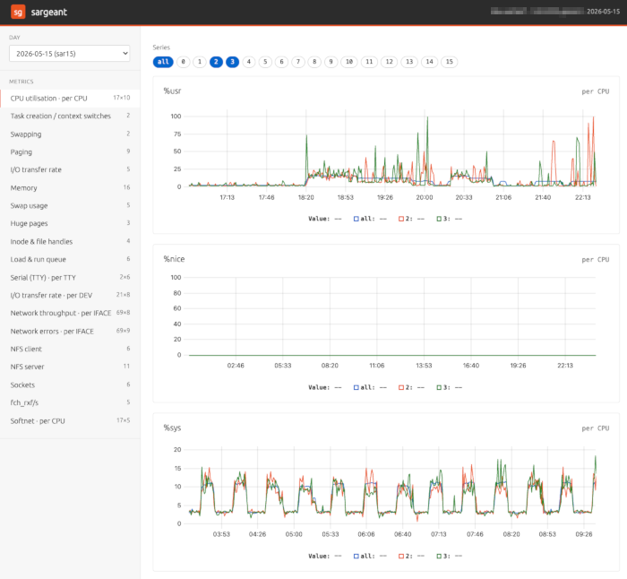
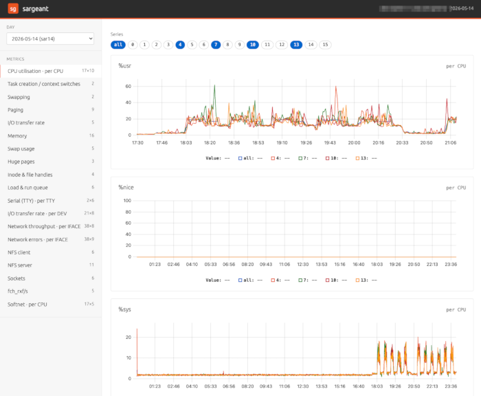
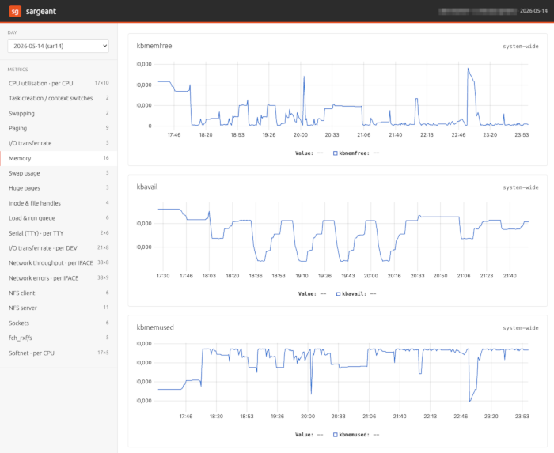

# sargeant

sargeant is a browser viewer for sar (sysstat) text reports. It was written for support engineers who need to read sar data out of a customer's sosreport, but it works for any sar text file.

It has no third-party dependencies. The backend is the Python standard library `http.server`, the parser is plain Python, and the charts use [uPlot](https://github.com/leeoniya/uPlot), which is vendored under `static/` so the app runs fully offline.







## How it works

* **Backend:** stdlib `http.server`, with no web framework and no dependencies to track.
* **Parser:** data-driven. Sections are found by structure (blank-line boundaries plus column
    headers) rather than a fixed list, so sar versions that emit new sections still render. The
    sources it follows are cited at the top of `parser.py`.
* **Frontend:** Canonical's Vanilla design tokens plus uPlot for the time-series charts.
* **PDF export:** a hand-rolled, standard-library-only PDF writer (`pdfreport.py`), so charts
    can be saved and shared without adding a single dependency.

## Two modes

sargeant runs in one of two modes.

**Offline** is the default. It serves the `sarNN` text files in a directory, read only, for a single
  local user, and trusts those files.

```sh
python3 server.py                                  # serve the sarNN files here
python3 server.py --data /path/to/sosreport/sar    # serve a specific directory
```

Then open <http://127.0.0.1:8799/> in your browser to navigate through the sar data.

Only the text `sarNN` reports are read. The binary `saNN` files are ignored, so you do not need
`sar` or `sadf` installed.

**Hosted** turns on the upload endpoint and per-session isolation, so anyone who can reach the server can upload sar text and view it. You switch it on by giving it an uploads directory:

```sh
python3 server.py --uploads-dir /var/lib/sargeant/uploads
```

Each visitor gets a random session cookie backed by its own directory. Uploads are size and count capped, parsing is bounded, and idle sessions are reaped on a timer. Hosted mode is meant to sit behind a reverse proxy that terminates TLS. For a full public deployment, see [DEPLOY.md](DEPLOY.md) and the example[Caddyfile](Caddyfile).

The easiest way to run hosted mode is Docker:

```sh
docker compose up -d
# then open http://127.0.0.1:8799/
```

The image is pure-stdlib Python on Alpine, with a read-only root filesystem, uploads on a RAM-backed tmpfs, dropped Linux capabilities, and memory, CPU, and PID limits. You can change the limits through `environment:` in `docker-compose.yaml` without rebuilding.

## Exporting charts to PDF

Any chart sargeant can draw, it can also save as a small vector PDF, for attaching to a support
case or sharing with someone who does not have the sar file. Both routes below use the same
renderer, so they produce the same output.

**From the command line**, without starting the server:

```sh
python3 server.py --output foo.pdf --metrics kbhugfree,tps,wtps --data /path/to/sosreport/sar
python3 server.py --output cpu.pdf --metrics %usr,%iowait --entities all,0,1 --file sar17
```

* `--metrics` takes sar column names, comma separated; each one becomes a chart. A name that
  appears in more than one section, like `tps`, resolves to the system-wide section; qualify it
  with the section's entity key (`DEV:tps`) for the per-entity version. A name sargeant does not
  recognize prints every available column, grouped by section, so you do not have to guess.
* Keyed sections (per CPU, DEV, IFACE, …) plot the same series the UI would pick by default —
  `all` for CPU, the first few devices otherwise — unless `--entities` chooses specific ones.
* Without `--file`, the newest day is exported, matching the UI's day picker.

**In the browser**, the **Export PDF** button in the sidebar saves exactly what is on screen:
the selected metric's charts, the series chosen with the chips, and the zoom window if you have
dragged one. It works in both modes; in hosted mode each session can only export its own uploads,
and the export carries the scrubbed hostname, not the original.

Every server option has a command-line flag and a matching `SG_*` environment variable. The environment variable sets the default, and an explicit flag overrides it. That is what lets the Docker image be configured entirely through `environment:`. The export flags are per-invocation actions, so they have no environment variables.

| Flag | Environment variable | Default | Mode | What it does |
|------|----------------------|---------|------|--------------|
| `--data DIR` | `SG_DATA` | the `server.py` directory | offline | Directory of `sarNN` files to serve. |
| `--uploads-dir DIR` | `SG_UPLOADS_DIR` | unset | selects mode | Base directory for per-session uploads. Setting it turns on hosted mode. |
| `--host HOST` | `SG_HOST` | `127.0.0.1` | both | Address to bind. |
| `--port PORT` | `SG_PORT` | `8799` | both | Port to bind. |
| `--max-upload-mb N` | `SG_MAX_UPLOAD_MB` | `25` | hosted | Largest single uploaded file, in MB. |
| `--max-session-mb N` | `SG_MAX_SESSION_MB` | `512` | hosted | Total storage per session, in MB. |
| `--max-files N` | `SG_MAX_FILES` | `64` | hosted | Files kept per session. |
| `--session-ttl-hours H` | `SG_SESSION_TTL_HOURS` | `6` | hosted | Idle session lifetime before it is reaped. |
| `--behind-tls` | `SG_BEHIND_TLS` | off | hosted | Force the `Secure` flag on the session cookie. A TLS proxy's `X-Forwarded-Proto: https` is detected on its own, so you usually do not need this. |
| `--output FILE.pdf` | — | unset | export | Write the charts named by `--metrics` to a PDF and exit, without starting the server. |
| `--metrics LIST` | — | required | export | Comma-separated sar columns to chart, e.g. `kbhugfree,tps` or `DEV:tps`. |
| `--file NAME` | — | the newest day | export | Which `sarNN` file to render. |
| `--entities LIST` | — | same as the UI | export | Series for keyed sections, e.g. `all,0,1` or `eth0,lo`. |

Run `python3 server.py --help` for the same list.

## HTTP endpoints

| Method | Path | Returns |
|--------|------|---------|
| GET | `/` | The single-page UI. |
| GET | `/static/<file>` | Vendored CSS and JS. |
| GET | `/api/files` | `{"files": [{"name", "day", "host"}, ...], "uploads": <bool>}` |
| GET | `/api/data?file=<name>` | The full parsed report as JSON. |
| GET | `/api/export?file=<name>&metrics=<cols>` | The named charts as a PDF download. Optional: `entities`, and `from`/`to` for a time window (seconds since the report's first midnight). |
| POST | `/api/upload?name=<file>` | Hosted mode only. Stores the request body and returns its metadata. |

## Using the parser on its own

`parser.py` runs standalone, with no server:

```sh
python3 parser.py sarNN          # one-line summary per section
python3 parser.py sarNN --full   # the full report as JSON
```

## Layout

| Path | Role |
|------|------|
| `parser.py` | Turns sar text into structured sections and series. Standard library only. |
| `pdfreport.py` | Renders sections to PDF — a from-scratch vector PDF writer. Standard library only. |
| `server.py` | The stdlib HTTP server, its two modes, and the export CLI. |
| `static/index.html`, `static/app.js`, `static/vanilla.css` | The UI. |
| `static/uplot.js`, `static/uplot.css` | The vendored chart library. |

## Features

* A day picker across every `sarNN` file, defaulting to the newest day.
* Every sar section listed, with a friendly label where one is known, plus its dimensions.
* Per-entity chips for keyed sections such as CPU, DEV, IFACE, and TTY.
* A time axis that handles sar's midnight rollover (the final `00:00:00` reading of the day).
* Shareable deep links of the form `#<file>/<sectionIndex>`, for example `#sar30/11`.
* PDF export of any charts — from the CLI (`--output`) or the sidebar button — as small vector
  files that keep the UI's colors, series selection, and zoom window.

## A note on the stylesheet

`static/vanilla.css` is a small stylesheet that follows [Canonical's Vanilla design language](https://design.ubuntu.com/vanilla), the Ubuntu typeface and Vanilla's color and spacing tokens) so the app stays self-contained and offline. It uses Vanilla's `p-*` class names, so you can drop in the full `vanilla-framework.min.css` build without touching the markup.
